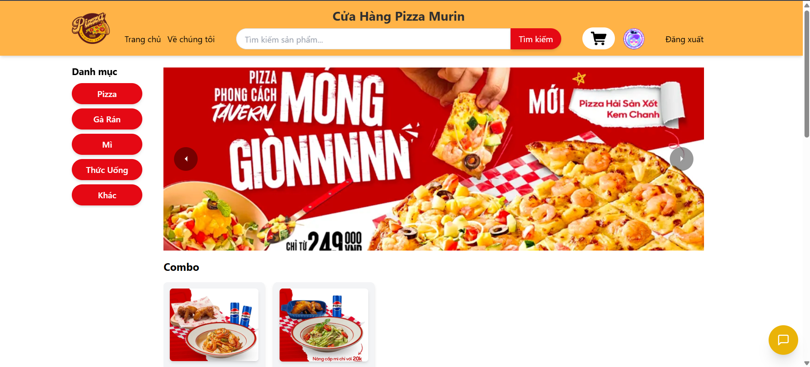
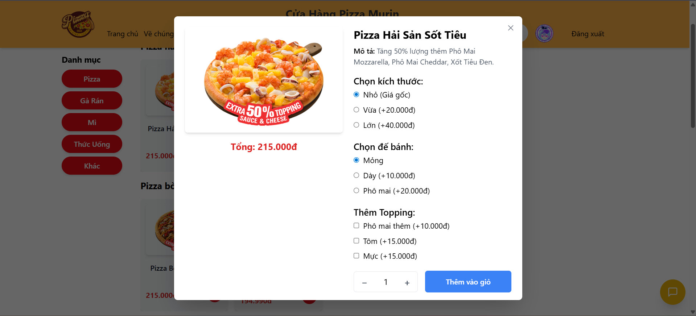
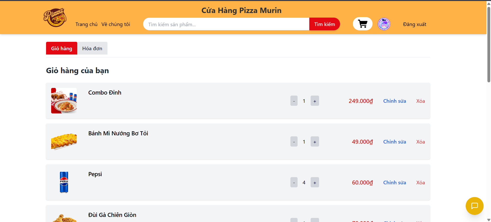
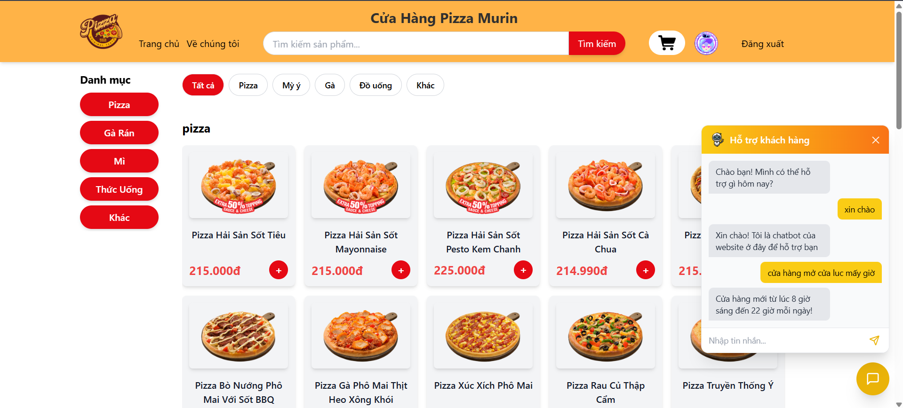

# Pizza Website 🍕

A full-stack pizza ordering website with AI-powered customer support chatbot.

## ⚠️ Note 
* This project is intended for local development only.
* Large AI model files (model.safetensors) are excluded from this repository.
* To run the chatbot service, you must provide the trained model files manually.

## Disclaimer

* This project was developed for educational purposes only.
* All product images belong to their respective owners and are used solely for demonstration and academic purposes.
* No commercial use is intended.

## Preview

### Home Page



### Customization Page


### Cart Page



### Chatbot



## Features

### Customer Features

* User registration and login
* Product browsing
* Pizza customization (size, crust, extras)
* Cart management
* Online payment with MoMo
* Profile management


### AI Chatbot

* Vietnamese customer support chatbot
* Intent classification using BERT
* Semantic matching using Sentence-BERT
* Conversation history support

### Admin Features

* Product management
* Order tracking
* Customer management

## Technologies Used

### Frontend

* React
* Vite
* JavaScript
* CSS

### Backend

* Node.js
* Express.js
* MongoDB
* Mongoose

### AI Chatbot

* Python
* FastAPI
* Hugging Face Transformers
* BERT
* Sentence-BERT
* PyTorch

## Project Structure

```text
WebPizza/
│
├── vite-project/          # Frontend
├── backend/               # NodeJS API
├── backend/python/        # Chatbot API
│
├── README.md
└── LICENSE
```

## Installation

### Frontend

```bash
cd vite-project
npm install
npm run dev
```

### Backend

```bash
cd backend
npm install
node server.js
```

### Chatbot API

```bash
cd backend/python
pip install -r requirements.txt
python chatbotApi.py
```

## Environment Variables

Create a `.env` file:

```env
MONGO_URI=
EMAIL_USER=
EMAIL_PASS=
TWILIO_SID=
TWILIO_TOKEN=
```

## Future Improvements

* JWT Authentication
* Recommendation System
* Real-time Order Tracking
* AI Pizza Recommendation

## Author

GitHub: @TranKhanhDuy-dev

## License

MIT License
